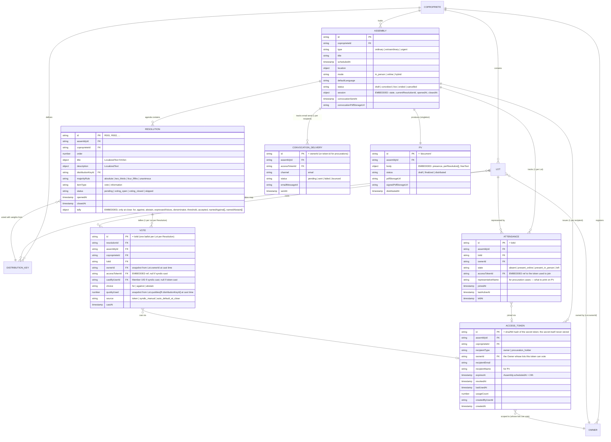
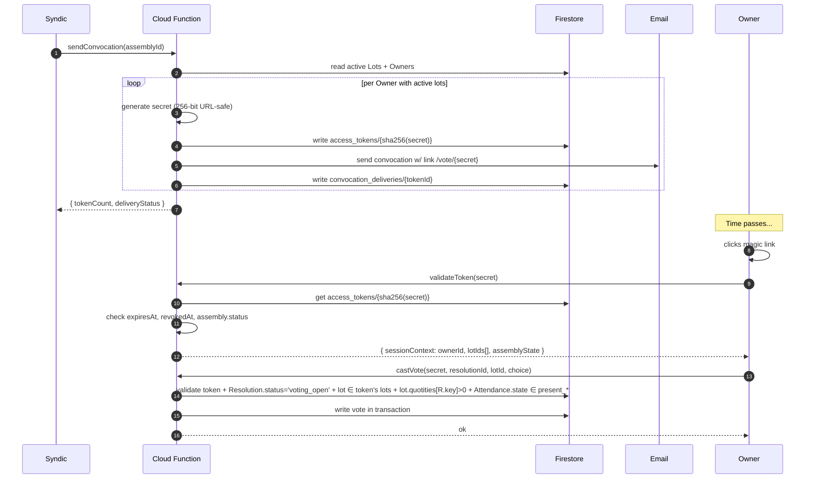
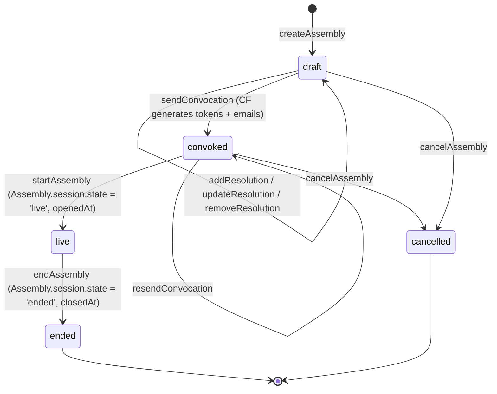
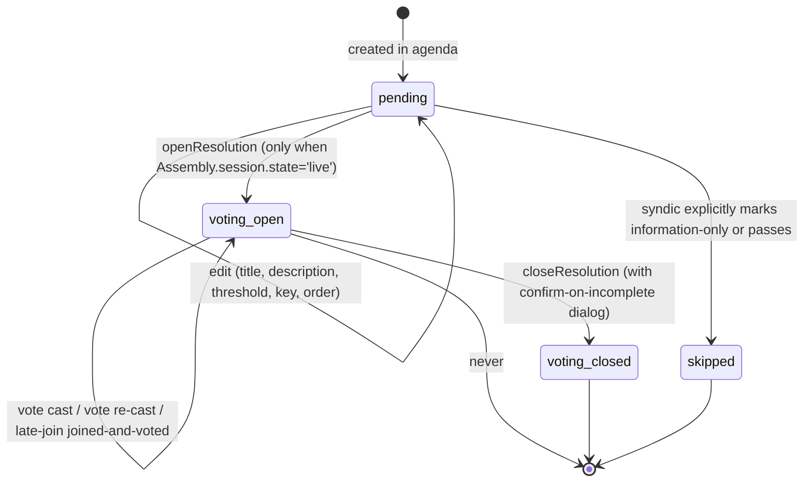
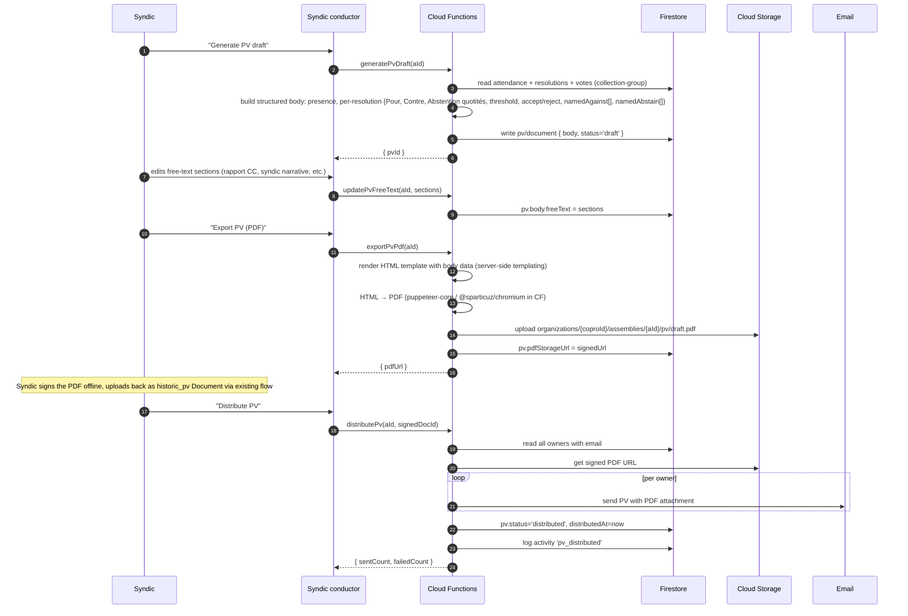

# Syndicable V1.1 — AG (Assemblée Générale) Implementation Plan

## 1. Context

Syndicable V1.0 is shipped: copropriété setup, lots, owners, lot-ownerships, distribution keys, documents, activity log, Phase-14 representative model. The recent G6 cleanup made `Lot ↔ Owner` strictly 1:1 (`Lot.ownerId`, `LotOwnership` lean).

V1.1 = the **Assemblée Générale module**: drafting an AG, sending convocations, running the live voting session with the syndic as conductor, generating the PV. AG only — no appels de fonds, no banking, no decomptes, no in-app PV signing. Detailed scope in the locked V1.1 entry of `docs/decisions-log.md` (2026-05-08).

The legal substrate (Belgian Civil Code Book 3, Articles 3.84–3.100, post-2018 reform) is verified; doc references corrected away from the old 577-x numbering. See `docs/app-architecture.md §3.3` for the legal cheat-sheet.

This plan is **design + phasing**. Code does not start until the user signs off.

---

## 2. Scope (recap from decisions log)

**IN — V1.1 ships:**
- AG creation + manual agenda entry
- Convocation: email-only with PWA magic link, manual agenda, electronic-delivery consent assumed for V1
- **Public token-based voting page** (no Firebase Auth required) — recipient just clicks the magic link
- Same magic-link mechanism for owner-self and procuration-holder
- Owner attendance via the public page (online only); syndic can manually flag in-person attendance
- Live syndic-conductor flow: start AG → open R_n → live tally → close R_n with confirm-on-incomplete → end AG
- Auto-default-to-abstain at close for present-but-silent owners (DV3)
- "Doesn't concern you" UX for zero-quotité lots
- Late join + explicit leave during the session
- PV: auto-draft + free-text edit + PDF export + email distribution + storage as `historic_pv` Document

**Legal must-haves baked in:**
- 15-day notice (warn at <15, allow override)
- Double quorum at AG open ((>½ owners ∧ ≥½ quotités) OR >¾ quotités)
- Vote always in quotités, never heads
- Abstentions/blank/null excluded from for/against denominator
- Indivision = single ballot per lot (already done — D14)
- Hybrid AG flag in convocation
- PV must list names of those who voted "against" + those who "abstained"
- 30-day PV transmission (manual reminder for V1.1; automated later)
- 4-month contestation window (noted in PV, not tracked in-app)

**OUT — deferred:**
- Convocation auto-extraction from Word/PDF (Kevin's #1 differentiator) — phase 2
- Postal/registered convocation channel — handled by syndic outside system
- In-app PV signing surface — syndic signs PDF offline + uploads back
- USB voting devices (Boîtiers de vote)
- Second-call AG auto-flow — syndic creates a new AG manually
- Owner-submitted §3 agenda items
- Annexes upload pipeline — link externally
- 30-day PV transmission reminder automation
- 4-month contestation window UI

---

## 3. Architecture overview

### 3.1 Entity-relationship diagram



### 3.2 Storage layout (Firestore)

```
organizations/{coproId}/
  assemblies/{aId}                                    Assembly (with embedded session + convocation refs)
    resolutions/{rId}                                 Resolution (with embedded tally on close)
      votes/{lotId}                                   Vote (one per Lot per Resolution)
    attendance/{lotId}                                Attendance (one per Lot)
    access_tokens/{sha256(secret)}                    AccessToken (key = hash; secret never stored)
    convocation_deliveries/{tokenId}                  ConvocationDelivery
    pv/document                                       Pv (singleton — procès-verbal)
```

Why these decisions:
- **One Vote doc per Lot per Resolution** — no contention (different docs per lot), one-cast-overwrites-previous semantics for free, deterministic ID.
- **Tally embedded on Resolution, computed at close** — no hot-spot during live voting (D4 from V1.0 spec).
- **Quorum computed on demand** — no counter to maintain.
- **Access tokens keyed by hash** — the secret never lands in Firestore. Lookup by hashing the URL parameter. Revocation = set `revokedAt`.
- **Attendance is the legal record of presence**; ephemeral "currently connected" is `lastActiveAt` heartbeat (see §3.5).

### 3.3 Auth model — public magic-link tokens

The user's locked decision: owners vote from a **public page on the website** with no Firebase Auth, no Member account creation. The token in the URL is the credential.



Token security:
- **256-bit URL-safe random**, generated server-side via `crypto.randomBytes(32).toString('base64url')`.
- **SHA-256 hashed** before storage. Lookup is `db.doc(\`.../${sha256(secret)}\`).get()`. The secret never appears in Firestore — a leak of the database doesn't leak active tokens.
- **Constant-time hash comparison.** Any byte-level comparison of the URL secret against stored values goes through `crypto.timingSafeEqual()` (or an equivalent constant-time primitive). No `===` on bytes derived from secrets — closes the timing-side-channel door even though SHA-256 lookup makes practical timing attacks far-fetched.
- **HTTPS only** for the public route.
- **Rate limiting** on `validateToken` (per IP) — 5/sec, 60/min — to make brute-forcing the 256-bit space infeasible (it already is, but defense in depth).
- **Scoped to one Assembly**: token has `assemblyId`. Cannot vote on a different Assembly even if the token leaks.
- **Bound to Owner server-side**: token has `ownerId`; client cannot tell the server "I want to vote for a different lot." Server resolves owner→lots itself.
- **Revocable**: syndic can revoke a token via `revokeAccessToken`; subsequent calls fail.
- **Auto-expires** 24h after `Assembly.scheduledAt` for cleanup.

**Why doc ID = SHA-256(secret) (and not "the secret somewhere in a field").** The secret is the credential — same threat profile as a password. We never store it. The doc ID *is* the hash, so validation is a one-step lookup: `secret = req.params.secret → hash = sha256(secret) → doc = db.doc('.../access_tokens/{hash}').get()`. There is no field `accessToken.secret`, no encrypted-at-rest blob, nothing to decrypt. **A full Firestore data leak does not leak a single active token** — only one-way hashes. The secret only ever exists in three places: the recipient's email, their browser URL bar, and the `castVote` request body in transit (TLS). If either of the first two is compromised, the syndic revokes the token. If the database leaks, no token is exposed.

### 3.4 Why public + token (vs. Phase-14 invitation route)

Earlier in this conversation we considered piggy-backing on the existing Phase-14 representative invitation flow (`inviteRepresentative` + `acceptInvitationByEmail`), which creates a Member doc with `Owner.representedBy[]` populated. The user explicitly asked for a public, account-less flow instead. Why the public-token route is right for V1.1:

| Concern | Phase-14 invitation route | Public token route |
|---|---|---|
| Owner needs to remember a password / OTP | Yes (email-OTP each time) | No (magic link is the auth) |
| Persistent membership artifacts | Member doc, role, scopes — needs to be cleaned up post-AG | None — token expires; no permanent state |
| Procuration handling | Same flow with `representsOwnerIds` | Same flow — syndic generates a token scoped to the proxy holder |
| Syndic can issue last-minute | Yes but slower (invite+accept+login) | Yes (one CF call generates a fresh token + email) |
| Complexity of the public page | Has to handle Firebase Auth state | None — just token in URL |
| Legal traceability | UID in `Vote.castByUserId` | TokenId in `Vote.accessTokenId`; `Attendance.representativeName` for PV |

The token route is leaner and matches the actual UX a 75-year-old copropriétaire on their phone needs. **Phase-14 is still used for owner-data management** (representatives editing owner metadata between AGs) — the two coexist. Vote-time auth is the public token; data-time auth is Phase-14 / Member roles.

### 3.5 Real-time data layer — Firestore vs RTDB

The user asked specifically about RTDB. Trade-off:

| Aspect | Firestore | RTDB |
|---|---|---|
| Vote writes (durable record) | ✅ transactional, queryable | ❌ no transactions on multi-doc |
| Live tally clients see | ✅ listener on `votes` sub-collection — sub-second | Possible but redundant |
| Current-resolution pointer | ✅ `Assembly.session.currentResolutionId` listener — sub-second | Possible |
| Presence heartbeat (every 30-60s) | ⚠️ ~10 writes/sec across a 360-lot AG = manageable but $ | ✅ cheaper for high-frequency |
| `onDisconnect()` for "user closed browser" | ❌ no native equivalent | ✅ first-class |

**V1.1 MVP recommendation: Firestore-only.** Periodic heartbeat (every 60s) updates `Attendance.lastActiveAt` from the public voter page. A scheduled Cloud Function runs every 2 minutes during a live AG and flags lots whose `lastActiveAt > 3 minutes ago` as `state = 'left'` (with audit log). Cost: 1 write/min/lot during the AG = for a 166-lot AG over 2 hours, ~20K writes total, well within free tier. Latency: 60-180s before "left" is reflected — acceptable for the legal record.

If we ever hit cost or latency issues (1000+ lot buildings, hours-long AGs), add RTDB later for presence only (`/presence/{aId}/{lotId}` with `onDisconnect`). Won't change the Firestore data model.

### 3.6 Safety + reconciliation

| Risk | Mitigation |
|---|---|
| **Token leak / shoulder-surfing** | Tokens scoped to one Assembly + bound to one Owner server-side. Revocable. SHA-256 hashed in storage. Rate-limited validation. |
| **Replay attack — same vote N times** | Vote doc ID = lotId; re-casts overwrite. Last write wins. Audit log records every cast (incl. overwrite). Owner sees their current choice in the UI. |
| **Vote on closed resolution** | `castVote` runs in a Firestore transaction: reads `Resolution.status` inside the tx; rejects if not `voting_open`. Even if a syndic clicks "close" while votes are in flight, the tx serializes. |
| **Vote on non-concerned resolution** | `castVote` validates `Lot.quotities[R.distributionKeyId] > 0` server-side. UI hides the buttons but server is the gate. |
| **Vote without joining** | `castVote` validates `Attendance.state ∈ {present_online, present_in_person}`. If a token is used to vote without first opening the public page, server creates the Attendance + Vote in the same tx. |
| **Multiple syndics conducting at once (race)** | Live-session control writes (`openResolution`, `closeResolution`, `endAssembly`) include an `ifMatch` precondition on `Assembly.session.state` + `currentResolutionId` to detect concurrent edits. Last writer wins is acceptable; UI re-syncs from Firestore listener. |
| **Auto-default at close double-counts** | `closeResolution` runs in a transaction: reads attendance + existing votes for R, computes the default-set, writes new Vote docs only for lots with no existing Vote. Idempotent if retried. |
| **Quorum drift mid-AG** | Quorum is computed on demand from Attendance + Lot.quotities. Each resolution's tally locks `denominator` at close, so retroactive joins/leaves don't change past tallies. Brugmann PV behavior matches: per-resolution tallies frozen at vote close. |
| **Late vote arrival after close** | Tx detects `Resolution.status !== 'voting_open'`, rejects with `failed-precondition`. Client retries are gracefully refused. |
| **Token expires mid-AG** | `expiresAt = Assembly.scheduledAt + 24h`. AG is expected to finish well before. Token remains valid even if AG runs late. |

Activity log entries for every AG-relevant mutation. PV body snapshots all tally + nominative votes at close — even if Firestore data is later edited, the PV stays the legal record.

**Firestore rules — `access_tokens` is server-only.** Even though the secret never lands in storage, the access-token sub-collection is treated as defense in depth:

```
match /organizations/{coproId}/assemblies/{aId}/access_tokens/{tokenHash} {
  allow read, write: if false;  // All access via Cloud Functions only
}
```

No client can read or enumerate the collection — not even by guessing hashes. Every legitimate access (validation, revocation, listing for the syndic's "issued tokens" UI) goes through a Cloud Function that has admin-SDK privileges and applies its own authz checks. Same pattern for `convocation_deliveries` (contains `emailMessageId` which is sensitive enough to gate behind syndic-role CFs).

---

## 4. State machines

### 4.1 Assembly lifecycle



Transitions:
- `draft → convoked` allowed only if ≥1 voting Resolution exists. If `scheduledAt` is in <15 days, CF returns a soft warning the syndic must override; not a hard block (per legal §3 + scope decision).
- `convoked → live` allowed only by a syndic-level Member of the copro. Sets `session.state = 'live'`, `openedAt`. Cannot be re-entered after `ended`.
- `live → ended` allowed only by syndic-level. All open Resolutions are auto-closed first (with the standard auto-default-to-abstain dialog confirmation, applied per resolution).
- `cancelAssembly` blocked once `live` (you have to `endAssembly` instead). Tokens revoked on cancel.

### 4.2 Resolution lifecycle



Transitions:
- `pending → voting_open` requires `Assembly.session.state = 'live'`. Sets `Resolution.status = 'voting_open'`, `openedAt`. Updates `Assembly.session.currentResolutionId = R_n`.
- `voting_open → voting_closed` is the **manual** close action. If any present-and-concerned lot has not voted, CF returns a list (`pendingLotIds: string[]`) — the UI shows the dialog, syndic confirms, CF re-runs with `confirmAutoDefault: true` and writes auto-default Vote docs in the same tx as the status flip + tally compute.
- **Re-opening a closed resolution** is forbidden in V1.1 — append a fresh resolution ("Réouverture du vote sur X") if needed. (Open question: revisit if real syndics demand it. Per Brugmann's clean PV, this isn't typical.)
- Resolutions can be re-ordered while `pending` only. Once `voting_open`, the order locks.
- `pending → skipped` for items that turn out to be information-only mid-AG, or where the syndic decides to defer.

### 4.3 Attendance state machine

```mermaid
stateDiagram-v2
    [*] --> absent: AG starts; no token used yet
    absent --> present_online: validateToken called for the first time
    absent --> present_in_person: syndic manually marks (in-room attendee)
    present_online --> present_online: heartbeat keeps lastActiveAt fresh
    present_online --> left: explicit "Quitter l'AG" click OR heartbeat lapses >3min
    present_in_person --> left: syndic manually marks
    left --> present_online: token re-used (re-join)
    left --> present_in_person: syndic manually re-marks
    present_online --> [*]: AG ends
    present_in_person --> [*]: AG ends
    left --> [*]: AG ends
    absent --> [*]: AG ends (never joined)
```



Per DV3:
- **`absent` lots are never counted** for any tally; they're the AG's "didn't show up" pile.
- **`present_*` and `left` lots are both counted as "present at some point"** for the auto-default-to-abstain rule. Once you've joined, you can't dodge being on the for/against/abstain ledger by closing your browser. Aligns with in-person AG: if you arrive and silently slip out, you're recorded as having been there.

Open question for the user: should `left` lots be treated as `present` (auto-abstain at close) or as `absent` (not counted)? My recommendation: treat as **`present` (auto-abstain)** — this is the conservative legal reading and matches Brugmann's PV behavior. Will flag in Open Questions for confirmation.

---

## 5. Flows

### 5.1 Pre-AG: drafting and convocation

```mermaid
sequenceDiagram
    autonumber
    participant Syndic
    participant UI as Syndic UI
    participant CF as Cloud Functions
    participant FS as Firestore
    participant Email as Resend

    Syndic->>UI: "Create AG" wizard (date, location, type, mode)
    UI->>CF: createAssembly(coproId, ...)
    CF->>FS: write assemblies/{aId} (status='draft', empty agenda)
    CF-->>UI: { assemblyId }

    loop for each resolution
        Syndic->>UI: "Add resolution" form (title, description, threshold, distribution key, type)
        UI->>CF: addResolution(aId, ...)
        CF->>FS: write resolutions/{rId} (order=N, status='pending')
    end

    Syndic->>UI: "Review + send convocation"
    UI->>CF: sendConvocation(assemblyId, languageOverrides?)
    CF->>FS: read active Lots (where ownerId != null)
    CF->>FS: read Owners
    CF->>CF: 15-day check; if scheduledAt<15d, return warning
    Syndic->>UI: confirms warning override (or aborts)
    UI->>CF: sendConvocation(aId, override=true)

    loop per Owner with ≥1 active lot
        CF->>CF: generate secret (32 random bytes, base64url)
        CF->>FS: write access_tokens/{sha256(secret)} (recipientType='owner', ownerId, expires)
        CF->>CF: build per-language convocation HTML + PDF
        CF->>Email: send to Owner.email with magic link /vote/{secret}
        CF->>FS: write convocation_deliveries/{tokenId} (status='sent', emailMessageId)
    end

    CF->>FS: assembly.status = 'convoked', convocationSentAt = now
    CF-->>UI: { tokensIssued, deliveriesSent, deliveriesFailed }

    Note over Syndic: For procurations (any time pre-AG):

    Syndic->>UI: "Add procuration" (mandantOwnerId, holderName, holderEmail)
    UI->>CF: issueProcurationToken(aId, mandantOwnerId, holderName, holderEmail)
    CF->>CF: generate secret
    CF->>FS: write access_tokens/... (recipientType='procuration_holder', ownerId=mandantOwnerId, recipientName=holderName)
    CF->>Email: send to holderEmail with magic link
    CF->>FS: log activity 'procuration_token_issued'
    CF-->>UI: { tokenId, sentTo }
```

Notes:
- **Convocation email contents**: per-owner localized greeting + AG metadata + agenda summary + the magic link. PDF attachment is the formal convocation (per Belgian Art. 3.87 §3 — agenda must be communicable; embedding it in HTML alone might not satisfy if challenged).
- **Indivision**: one Owner per indivision (D14), so one token covers the indivision's lot. Multiple representatives in `Owner.representedBy[]` is irrelevant for AG voting — the token is the only credential.
- **Procurations**: separate token per (absent owner, proxy holder). The procuration relationship is implicit in the token's metadata and reflected in `Vote.accessTokenId → AccessToken.recipientName` for the PV. No `proxies/` collection per revised DV2.

### 5.2 AG-time: live session

```mermaid
sequenceDiagram
    autonumber
    actor Syndic
    actor Owner
    participant Pub as Public voter page
    participant Cnd as Syndic conductor
    participant CF as Cloud Functions
    participant FS as Firestore

    Syndic->>Cnd: "Start AG"
    Cnd->>CF: startAssembly(aId)
    CF->>FS: assembly.session = {state:'live', openedAt:now}, status='live'
    CF-->>Cnd: ok
    Cnd->>FS: subscribe (assembly, attendance, resolutions, votes via collection group)

    Note over Owner: Owner clicks magic link
    Owner->>Pub: GET /vote/{secret}
    Pub->>CF: validateToken(secret)
    CF->>FS: get access_tokens/{sha256(secret)}
    CF->>FS: read assembly + owner + lots(ownerId=token.ownerId)
    CF-->>Pub: { ownerName, lots, assemblyState, currentResolutionId? }
    Pub->>CF: joinAssembly(secret)
    CF->>FS: tx: for each lot of owner, upsert attendance/{lotId} (state='present_online', joinedAt, lastActiveAt)
    CF-->>Pub: ok
    Pub->>FS: subscribe (assembly.session, currentResolution if any)

    loop while AG live
        Pub->>CF: heartbeat(secret) every 60s
        CF->>FS: tx: update attendance/{lotId}.lastActiveAt
    end

    Note over Syndic: For each agenda item

    Syndic->>Cnd: "Open R_n"
    Cnd->>CF: openResolution(aId, rId)
    CF->>FS: tx: resolution.status='voting_open', openedAt; assembly.session.currentResolutionId=rId
    CF-->>Cnd: ok
    Note over Pub: All public pages receive the change via listener

    alt lot HAS quotités in R.distributionKeyId
        Pub->>Owner: show "Pour / Contre / Abstention"
    else lot has 0 quotités
        Pub->>Owner: show "Cette résolution ne vous concerne pas"
    end

    Owner->>Pub: clicks "Pour"
    Pub->>CF: castVote(secret, rId, lotId, choice='for')
    CF->>FS: tx: validate token + R.status='voting_open' + lot.ownerId=token.ownerId + Lot.quotities[R.key]>0 + Attendance.state ∈ present_*
    CF->>FS: tx: write votes/{lotId} with quotityUsed snapshot, source='token'
    CF-->>Pub: ok
    Pub->>Owner: "Vous avez voté Pour. Vous pouvez changer jusqu'à la clôture."
    Note over Cnd: Conductor sees live count update via listener

    Note over Syndic: Manual close
    Syndic->>Cnd: "Close R_n"
    Cnd->>CF: closeResolution(aId, rId, confirmAutoDefault?:false)
    alt all present-concerned lots have voted
        CF->>FS: tx: write Resolution.tally + status='voting_closed', closedAt
        CF-->>Cnd: ok
    else some present-concerned lots haven't voted
        CF-->>Cnd: { pendingLotIds[] }
        Cnd->>Syndic: dialog "X présents n'ont pas voté. Enregistrer en abstention?"
        Syndic->>Cnd: confirms
        Cnd->>CF: closeResolution(aId, rId, confirmAutoDefault=true)
        CF->>FS: tx: write auto-default abstain votes (source='auto_default_at_close') + tally + status='voting_closed'
        CF-->>Cnd: ok
    end
    Note over Pub: Public pages see status change; show "Vote clos. En attente de la prochaine question."

    Note over Syndic: People can still leave during the session
    Owner->>Pub: clicks "Quitter l'AG"
    Pub->>CF: leaveAssembly(secret)
    CF->>FS: attendance/{lotId}.state='left', leftAt

    Note over Syndic: End AG
    Syndic->>Cnd: "End AG"
    Cnd->>CF: endAssembly(aId)
    CF->>FS: tx: any open R closed first (with auto-default if needed); session.state='ended', status='ended'
    CF-->>Cnd: ok
    Note over Pub: Public pages show "L'AG est terminée."
```

### 5.3 Vote-cast critical path (zoomed in)

```mermaid
sequenceDiagram
    autonumber
    participant Pub as Public voter page
    participant CF as castVote
    participant FS as Firestore (tx)

    Pub->>CF: castVote(secret, resolutionId, lotId, choice)
    CF->>CF: rate-limit check (per IP; 5/sec, 60/min)
    CF->>FS: get access_tokens/{sha256(secret)}
    alt token missing or expired or revoked
        CF-->>Pub: 401 unauthorized
    end
    CF->>CF: assert assemblyId from token == request

    CF->>FS: BEGIN TRANSACTION
    FS->>FS: read assembly (must be session.state='live')
    FS->>FS: read resolution (must be status='voting_open')
    FS->>FS: read lot (must be lot.ownerId == token.ownerId AND lot.coproprieteId == token.coproId)
    FS->>FS: read distribution_key.entries[lotId] (must be > 0)
    FS->>FS: read attendance/{lotId} (must exist; state ∈ present_*)
    alt any check fails
        CF-->>Pub: 412 failed-precondition (with reason)
    end
    FS->>FS: write votes/{lotId} { resolutionId, lotId, ownerId, choice, quotityUsed=snapshot, source='token', accessTokenId, castAt:now }
    CF->>FS: COMMIT
    CF-->>Pub: ok
```

**Why no token-doc write here.** The vote-cast critical path writes exactly one doc — the Vote — and never touches `access_tokens`. The reason is contention: an Owner with N lots clicks Pour on a freshly-opened resolution and casts N votes within a second. Each vote lands in a different Vote doc (no contention there), but if every cast also touched `access_tokens/{tokenHash}`, the same token doc would absorb N writes/sec — past Firestore's documented 1-write/sec/doc soft limit on a 6-lot owner, and easily into the 6–10 writes/sec/token range on the Brugmann-style multi-lot owners (one owner with ~10 lots is realistic). We'd see `RESOURCE_EXHAUSTED` retries that surface to the voter as an apparent failure on a button they just clicked.

Token-usage tracking is moved to `heartbeat` instead (§6) — once every 60s the public page sends a small payload that batch-updates `lastUsedAt` and increments `usageCount` by the count of votes cast since the previous heartbeat. The trade-off: `lastUsedAt` is stale up to 60s. That's well under the legal-trace bar (the votes themselves are the legal record; `lastUsedAt` is forensic metadata for the syndic's "did this token get used?" view).

### 5.4 Post-AG: PV draft + distribution



---

## 6. Cloud Functions inventory

Naming follows existing V1.0 pattern (verb + noun + feature). All europe-west1, all callable except where noted.

**Assembly lifecycle**
- `createAssembly` — syndic-only; creates `assemblies/{aId}` in `draft`.
- `updateAssembly` — `draft` only; edit metadata (title, scheduledAt, location, mode).
- `cancelAssembly` — `draft` or `convoked` only; revokes any tokens.
- `sendConvocation` — `draft → convoked`; generates tokens, sends emails.
- `resendConvocationToOwner` — re-issues a token + email for one owner (e.g. bounced).
- `startAssembly` — `convoked → live`; sets `session.state='live'`.
- `endAssembly` — `live → ended`; auto-closes any open resolution.

**Agenda**
- `addResolution` — `draft` only; appends to agenda.
- `updateResolution` — `pending` only; edit title, description, threshold, key, order.
- `removeResolution` — `pending` only.
- `reorderResolutions` — `pending` only; bulk update of `order`.

**Live session control**
- `openResolution` — `pending → voting_open`; sets `currentResolutionId`.
- `closeResolution` — `voting_open → voting_closed`; with `confirmAutoDefault` flag for the incomplete-vote dialog.
- `skipResolution` — `pending → skipped`; marks information-only or passed without vote.

**Public access (no Firebase Auth required; authenticated via token)**
- `validateToken` — verify a magic-link secret; returns sanitized session context. Wrapped in rate-limit middleware (see below).
- `joinAssembly` — first-time access call from the public page; sets Attendance to `present_online`. Rate-limited.
- `leaveAssembly` — explicit leave click; sets Attendance to `left`. Rate-limited.
- `heartbeat` — periodic (every 60s) from the public page. Updates `Attendance.lastActiveAt` and **batch-updates the token**: sets `access_tokens/{tokenHash}.lastUsedAt = now` and increments `usageCount` by the count of votes cast since the previous heartbeat (the public page tracks the count client-side and sends it in the payload). This is the only place token-usage metadata is written, keeping the vote-cast hot path off the token doc. Rate-limited (with a higher ceiling — heartbeat is expected once per minute per active session).
- `castVote` — the main public vote endpoint (see §5.3 critical path). **No token-doc write in the hot path; token usage tracking is batched via `heartbeat`.** Rate-limited.

**Rate-limit middleware.** All public-route Cloud Functions (`validateToken`, `joinAssembly`, `leaveAssembly`, `heartbeat`, `castVote`) are wrapped with the same middleware: 5 req/sec/IP and 60 req/min/IP, returning HTTP 429 on overrun. Implementation note for Phase C: in-process counter is fine if we keep these on a single Cloud Function (or pin to one min-instance); a Redis/Memorystore backend is required if we ever scale them across multiple CF instances or regions. The middleware sits before token validation so unauthenticated brute-force probes are also throttled.

**Procurations**
- `issueProcurationToken` — syndic generates a token scoped to (mandant owner, proxy holder name + email). Sends email with magic link.
- `revokeAccessToken` — revokes any token by id.

**Attendance helpers (syndic side)**
- `markAttendanceInPerson` — syndic flips `Attendance.state` to `present_in_person` for an in-room attendee.
- `markAttendanceLeft` — syndic flips state to `left`.

**PV (procès-verbal)**
- `generatePvDraft` — auto-build the PV body from AG state.
- `updatePvFreeText` — patch the free-text sections.
- `exportPvPdf` — render to PDF, upload to Storage, return signed URL.
- `distributePv` — email PDF to all owners + flag distributed.

**Triggers (Firestore)**
- `onVoteWritten` — increments live counters? No — voting tally is computed at close, not live. Trigger may emit activity log entry only.
- `onAssemblyWritten` — activity log emission.
- `onResolutionWritten` — activity log emission.
- `onAttendanceWritten` — activity log emission.

**Scheduled CF**
- `cleanupStaleAttendance` — every 2 minutes during a `live` AG, flips Attendance to `left` if `lastActiveAt > 3min ago`. Could also be implemented as a `joinAssembly`-triggered timer. Pubsub schedule.
- `expireOldTokens` — daily; deletes access_tokens past `expiresAt + 7d`.

**Total**: ~25 new Cloud Functions. None of the V1.0 functions need changes for V1.1.

---

## 7. Frontend surface

### 7.1 Syndic conductor view (authenticated)

Location: `src/routes/(dashboard)/organizations/[organizationId]/assemblies/`.

Sub-routes:
- `assemblies/+page.svelte` — list of past + upcoming AGs.
- `assemblies/new/+page.svelte` — create-AG wizard.
- `assemblies/[aId]/+page.svelte` — AG detail. Two modes:
  - **Pre-AG mode** (status `draft` / `convoked`): edit metadata + agenda. "Send convocation" button. List of issued tokens + delivery status.
  - **Live mode** (status `live`): the conductor. Visible:
    - Live AG-level quorum gauge (double quorum in/out)
    - Agenda timeline (pending / live / closed / skipped)
    - Currently-open resolution with: live tally, list of present-and-concerned lots not yet voted, "Close" button
    - Attendance list (present, in-person, online, left, absent) with manual flip actions
    - Procuration issue button
    - End AG button
  - **Post-AG mode** (status `ended`): generate / edit / export / distribute PV.

### 7.2 Public voter page (no auth)

Location: `src/routes/vote/[token]/+page.svelte` (or `+server.ts` for the validate redirect).

States:
- **Pre-AG** (assembly `convoked` but `session.state` not `live`): "Bonjour [Owner.displayName] / [Procuration holder name]. L'AG du [date] commencera bientôt."
- **AG live, no resolution open**: "L'AG est en cours. La prochaine résolution sera ouverte par le syndic."
- **Resolution open + lot concerned**: title + description + threshold tag. Three buttons: Pour, Contre, Abstention. After cast: "Vous avez voté X. Vous pouvez changer jusqu'à la clôture."
- **Resolution open + lot NOT concerned**: "Cette résolution ne vous concerne pas (vous n'avez pas de quotités dans la clé [keyName])."
- **AG ended**: récap of decisions. Link to (eventual) PV.

Plus a header: "[Copropriété name] — AG du [date]. Connecté en tant que [name]." A "Quitter l'AG" button.

Heartbeat ping every 60s from this page (only while `session.state === 'live'`).

The page is **hosted on the same Firebase Hosting domain** as the syndic app (e.g. `app.syndicable.io/vote/{token}`). No separate deploy. Firestore rules already block writes — all mutations go through Cloud Functions.

### 7.3 Email templates

- **Convocation owner email** (FR/NL/EN): owner name, AG metadata, agenda summary, magic link button, PDF attachment.
- **Procuration holder email** (FR/NL/EN): "Vous avez été désigné comme mandataire de [absent owner name] pour l'AG du [date]." Magic link, PDF attachment.
- **PV distribution email** (FR/NL/EN): summary of decisions, signed PDF attachment.

All built on the existing Resend infrastructure (`functions/src/features/resend/`). New templates: `convocationEmail.ts`, `procurationInviteEmail.ts`, `pvDistributionEmail.ts`.

---

## 8. Implementation phasing

Five phases, each shippable as a usable increment. Recommended sequence (each ≈ 1–2 weeks of work):

### Phase A — schema + AG drafting
- Backend: types for Assembly + Resolution + AccessToken (placeholders). Cloud Functions: `createAssembly`, `updateAssembly`, `addResolution`, `updateResolution`, `removeResolution`, `reorderResolutions`, `cancelAssembly`. Triggers: activity log emissions.
- Frontend: AGs list page, create-AG wizard, AG detail in pre-AG mode (metadata + agenda editing).
- Verify: syndic can create an AG, add 18 resolutions matching Brugmann's agenda, edit, cancel.

### Phase B — convocation send + magic links
- Backend: `sendConvocation`, `resendConvocationToOwner`, `issueProcurationToken`, `revokeAccessToken`. Email template `convocationEmail.ts` + `procurationInviteEmail.ts`. Activity log entries. PDF generation for the convocation (HTML template + puppeteer in CF).
- Frontend: "Send convocation" button, list of issued tokens + delivery status. "Add procuration" dialog.
- Public route: `/vote/{token}` skeleton showing "AG starting soon" (status `convoked`). `validateToken` Cloud Function.
- Verify: real emails go out for the Brugmann roster; clicking a magic link lands on the public page with the right name + AG title.

### Phase C — live session: presence + voting + close
- Backend: `startAssembly`, `endAssembly`, `joinAssembly`, `leaveAssembly`, `heartbeat`, `openResolution`, `closeResolution` (with auto-default-to-abstain), `skipResolution`, `castVote`, `markAttendanceInPerson`, `markAttendanceLeft`, `cleanupStaleAttendance` (scheduled).
- Frontend public: vote page in live mode (current resolution UI, vote buttons, "doesn't concern you", quitter button, heartbeat).
- Frontend syndic: conductor view in live mode (timeline, live tally, present-not-voted list, attendance panel).
- Verify: end-to-end with 5 test owners across 3 resolutions; auto-default-to-abstain works; offline browser close → cleanupStaleAttendance flips to `left`.

### Phase D — quorum + tally polish
- Backend: server-side quorum computation helper (callable from CF + readable client-side — symmetric query helpers per code-quality bar). `Resolution.tally` snapshot at close includes named exceptions (Vote.castByOwnerId → Owner.displayName).
- Frontend: AG-level quorum gauge (live, double-quorum check). Per-resolution tally view (post-close).
- Verify: replicate the Brugmann PV's per-resolution numbers from a recreated test AG.

### Phase E — PV: draft + edit + export + distribute
- Backend: `generatePvDraft`, `updatePvFreeText`, `exportPvPdf`, `distributePv`. Email template `pvDistributionEmail.ts`. PDF rendering pipeline (HTML template per language + puppeteer).
- Frontend: post-AG mode for the conductor: PV draft view, free-text WYSIWYG, export PDF button, distribute button.
- Verify: PV PDF for the Brugmann recreation matches the layout of the IGS sample within reasonable tolerance.

After Phase E ships, V1.1 is done.

---

## 9. Verification

Manual end-to-end test plan (post-Phase E):

1. **Setup**: copy the Brugmann data via the existing IGS bulk import. 166 owners, ~300 lots across 3 distribution keys (GEN, ASCENSEUR_9A, GARAGE).
2. **Pre-AG**: create AG dated 5 days from now (warning expected); override; add 18 resolutions matching Brugmann's agenda. Send convocation. Verify 166 emails sent; click 5 random magic links — public pages show correct names.
3. **Procuration**: issue 3 procuration tokens (different proxy holders). Verify their separate emails.
4. **AG-time**: start AG. Have 5 test users join (3 owners + 2 procuration holders). Verify Attendance entries. Open R1 (GEN key) — all 5 vote — close. Verify tally matches expected (with auto-default for the 161 absent owners' lots not happening since they're absent, not present). Open R2 (ASCENSEUR_9A) — 2 owners have 0 quotités there → "doesn't concern you" — others vote — close. Open R3 — close with one user having not voted; confirm auto-default dialog → confirm → verify abstain Vote written with `source='auto_default_at_close'`.
5. **Late join + leave**: have a 6th user join at R5; verify Attendance + ability to vote on R5+. Have user 1 click "leave"; verify state change.
6. **End AG**: with R7 still open, click "End AG" — verify R7 auto-closes (with auto-default if applicable) before assembly ends.
7. **PV**: generate draft → verify all tallies + named exceptions correct. Edit free-text. Export PDF. Distribute. Receive email with PDF attachment.

Plus full integration tests in `functions/test/integration/` for each Cloud Function (pattern per existing V1.0 tests).

---

## 10. Open questions / TBDs to resolve before / during implementation

1. **`left` lots' role in auto-default-to-abstain at close.** Current plan: treat as `present` (auto-abstain). Alternative: treat as `absent` (not counted). My recommendation: **`present`** (conservative legal reading, matches IGS workflow). Requires user confirmation.

2. **PDF generation pipeline.** Options: (a) Puppeteer + Chromium in Cloud Functions (heavy dependency, slow cold start, but full HTML/CSS); (b) a templating library like `pdfkit` (faster, less flexible); (c) external service. Recommendation: **(a)** — same approach as future PV generation, Belgian convocations have specific formatting that benefits from real CSS. Pre-warm a CF instance during AG-time.

3. **Heartbeat interval + stale threshold (now double duty).** Current plan: 60s heartbeat + 3min stale = `left`. Heartbeat now also batch-updates `access_tokens.{lastUsedAt, usageCount}` (see §5.3 / §6) — keeping that off the vote-cast hot path, at the cost of `lastUsedAt` being stale up to 60s. Acceptable for product UX and forensic metadata. If cost concerns arise on 360-lot AGs (~360 writes/min), consider RTDB presence (see §3.5) — that move would also change where token-usage tracking lives.

4. **Currently-open-resolution pointer collision.** If two browsers of the same syndic open the conductor and one clicks "Close R3" while the other clicks "Open R4" — both succeed, sequence is `close R3 → open R4` regardless. Fine. But if both click "Open R4" and "Open R5" at the same time, `currentResolutionId` jitters. Mitigation: optimistic concurrency (`ifMatch` on `Assembly.session.currentResolutionId` precondition). Decide complexity tradeoff during Phase C.

5. **Vote re-cast semantics.** UX choice: should the public page allow a user to change their vote up until close? Plan says yes ("vous pouvez changer jusqu'à la clôture"). Audit: every cast logged, last write wins. Confirm with user.

6. **Procuration + own-lot voting.** If a proxy holder is also an owner in the same copropriété, do they get **two separate magic links** (one for own lots, one for procurations) or **one merged link** (all lots in one session)? My recommendation: **two separate links** — clearer audit trail, simpler `Vote.accessTokenId` resolution.

7. **Convocation language selection.** Each Owner has a `language` field. Plan: per-owner localized email + per-owner localized PDF. Trade-off: 3 PDF generations per AG vs. one. PDF language is a syndic-level setting that fans out per owner during send.

8. **Hybrid AG in-person attendees.** Currently the conductor lets the syndic flip Attendance to `present_in_person` manually. Open: do those attendees still need a magic link to vote (via their own phone PWA)? Recommendation: **yes** — same public page. The syndic's manual flip just records the in-person fact for the PV.

9. **Audit log for vote changes.** When an owner re-casts (changes vote), should each cast be a separate `activity_log` entry? Recommendation: **yes** — per-vote audit trail, enabled by default, syndic can filter the log view post-AG.

10. **Resolution.itemType = 'information'.** Some Brugmann agenda items are info-only (e.g. "Travaux de toitures – Information"). Plan handles via `itemType: 'vote' | 'information'`. Open: do information items get listed in the PV or tracked otherwise? Confirm with user.

These 10 are not blockers — Phase A can start without resolving any of them. They're flagged so we resolve them as we hit each phase.

---

## 11. Annex: Belgian legal constraints baked into the AG module

The Belgian Civil Code Book 3 (post-2018 reform) prescribes how an AG of copropriétaires is convened, attended, voted, and recorded. Six rules sit upstream of every design decision in V1.1 — the auth model, the data model, the live session flow, and the PV. They are not a compliance checklist applied on top; they shaped the system. This annex names them and points to where each surfaces in the code.

| Constraint | What it means | Where it surfaces in the system |
|---|---|---|
| **15-day notice (Art. 3.87 §3)** | Convocation must be sent ≥15 days before the AG. The 21 days some buildings use is a best-practice from the règlement d'ordre intérieur, not statutory. | `sendConvocation` checks `assembly.scheduledAt - now ≥ 15 days`; under the threshold, returns a soft warning the syndic can override (true emergency or owner-acknowledged risk). |
| **Double quorum at AG opening (Art. 3.87 §5)** | The AG can deliberate validly only if at opening **either** (a) >½ of copropriétaires are present/represented AND they hold ≥½ of the quotités, **OR** (b) those present/represented hold >¾ of the quotités. If neither: second-call AG required ≥15 days later, no quorum requirement (§6). | Computed live during AG from Attendance + Lot.quotities[GEN]. Conductor view shows the gauge. Resolutions cannot be opened if quorum not met. |
| **Vote in quotités (Art. 3.87 §2)** | Votes are weighted by each lot's quotités (its share of the building, summed to 10000). Never head count. So a 500-quotités lot's "Pour" weighs 500 in the tally. | `Vote.quotityUsed` snapshots the lot's quotité in the resolution's distribution key at cast time. Tallies sum these, never count ballots. |
| **Indivision = 1 ballot per lot (Art. 3.87 §1)** | A lot owned in indivision (couple, siblings inheriting) is a single voting entity — one ballot, not one per person. They must designate a single mandataire. | Already done by D14 (one Owner record per ownership entity). Enforced by Lot.ownerId being 1:1. |
| **Hybrid AG flag in convocation (Art. 3.87 §1)** | If the AG is hybrid (some attendees in person, some online), this **must** be announced in the convocation. It can't be improvised at session start. | `Assembly.mode = 'hybrid'` set at AG creation; convocation PDF generation reads this and inserts the legal language about distance participation. Mode change post-convocation requires re-send. |
| **Named "against" + "abstain" in PV (Art. 3.87 §10)** | The PV must list the names of copropriétaires who voted against and those who abstained — not just the totals. The Brugmann PV does this literally. | `Resolution.tally.namedAgainst[]` and `namedAbstain[]` snapshot at vote close (from `Vote.castByOwnerId → Owner.displayName`). Rendered into the PV draft. |

### Glossary — "Tally" / "Décompte"

The **tally** (FR: *décompte*) is the embedded result on `Resolution.tally`. It is written **once at vote close** (per V1.0 spec D4 — never live during voting), with the totals, the threshold check, and the nominative arrays frozen for the PV. The live progress bar the conductor sees while voting is open is computed **client-side** by summing the `votes/{lotId}` sub-collection — Firestore listeners push sub-second updates without ever touching the Resolution doc. This is what lets us avoid a hot-spot on the Resolution doc during the 30 seconds when 100 voters click Pour at once.

---

## 12. What this plan is NOT

- It's not a code patch. No file is modified by approving this plan.
- It's not a final spec. The decisions log (and `app-architecture.md` §2.7 / §2.8) remains the durable source; this plan is the implementation roadmap.
- It's not a commitment to ship in N weeks. Phasing assumes one focused implementer; reality may differ.
- It does not cover appels de fonds, decomptes, banking, USB voting devices, in-app PV signing, or convocation auto-extraction. Those are in the deferred list per the locked scope.
